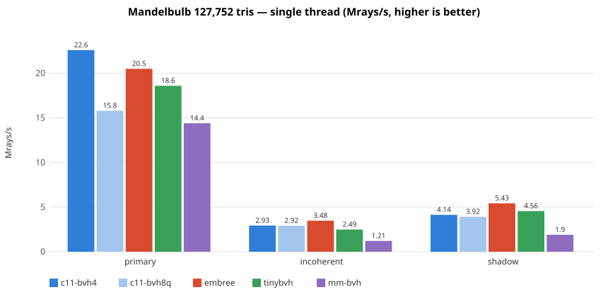
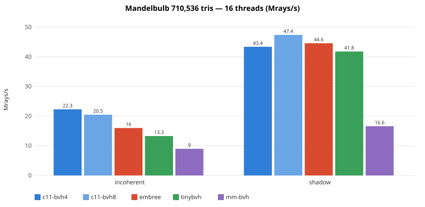
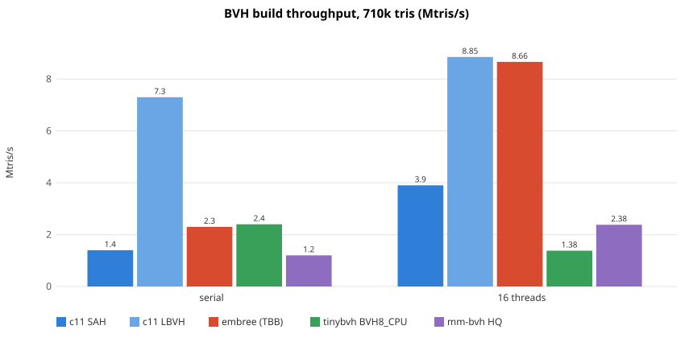
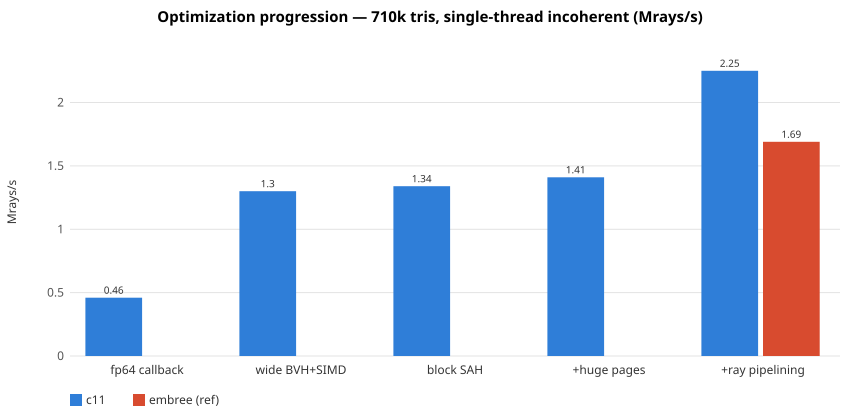
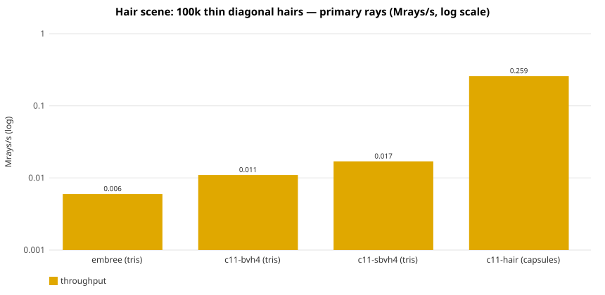

# LightRT C11 Triangle BVH — Performance Report

Measured 2026-06 on an AMD Ryzen Threadripper 1950X (Zen 1, 16 cores / 32
threads, SSE4.2/AVX2/FMA, quad-channel DDR4), gcc 13.3, `-O3`, transparent
huge pages enabled. Harness: [`benchmark_c/`](../benchmark_c/README.md) —
procedural mandelbulb scene (marching cubes), identical deterministic ray
sets for every backend, median of repeated runs, all backends verified to
≥ 99.9 % per-ray agreement against an fp64 brute-force oracle.

Backends: `c11-*` is this library (`lightrt_c_tri.h`, pure C11);
[Embree 4.3.3](https://github.com/RenderKit/embree) (`rtcIntersect1`/
`rtcOccluded1`), [tinybvh](https://github.com/jbikker/tinybvh) (`BVH8_CPU`),
and [madmann91/bvh v2](https://github.com/madmann91/bvh) (Quality::High).

## Single-thread ray throughput



`c11-bvh4` **leads every backend on primary (closest-hit) rays** — with the
coherent Ray4 packet (below) it reaches **1.3–1.5× Embree** at every scene size
(29.5 vs 20.0 Mrays/s at 128k ST; 22.6 vs 17.6 at 710k ST). Embree keeps its
single-thread leads on incoherent rays at cache-resident sizes (its kernels hide
latency per ray; we lead once the BVH exceeds cache) and on shadow/any-hit rays
(any-hit kernel design; tree quality, push ordering, leaf size, spatial splits,
and ray packets were all measured and ruled out — see below).

### Coherent ray packets (`LRT_TRI_BATCH_COHERENT`)

For coherent batches, closest-hit assembles 4 consecutive rays into a `Ray4`
SoA packet and tests one node box against all four lanes at once, so one node
(and one leaf block) fetch is amortized over the packet. Measured wins over the
per-ray kernel (which already used a per-octant child-order table):

| | per-ray | **Ray4 packet** | Embree |
|---|---|---|---|
| primary 128k ST | 23.4 | **29.5** | 20.0 |
| primary 128k 16T | 134 | **163** | 126 |
| primary 710k ST | 18.8 | **22.6** | 17.6 |

The packet is integrated into `lrt_tri_intersect1N(..., LRT_TRI_BATCH_COHERENT)`
for BVH4 (the SSE4 packet bit-matches the BVH4 single-ray kernel, so batched
results stay identical to looping `intersect1`). Crucially, **any-hit does *not*
packetize**: lockstep traversal runs until every lane resolves, which defeats
per-ray early termination — measured as a ~2× *loss* on shadow rays. So
`occluded1N` stays per-ray.

## Multi-threaded ray throughput



At 710k triangles and 16 threads, `c11-bvh4` leads incoherent rays
(1.1–1.3× Embree) and `c11-bvh8` leads shadow rays. The 8-way per-thread ray
pipelining stacks with thread-level parallelism.

## Build throughput



The default builder is a binned SAH (single-pass 3-axis binning, block-based
cost) with a deterministic parallel mode (subtree tasks on disjoint arena
slices — bit-identical trees at any thread count). `LRT_TRI_BUILD_FAST` is a
Morton/LBVH path (radix-sorted keys, highest-differing-bit splits) that
matches Embree's TBB build throughput while costing ~10–15 % traversal.
`LRT_TRI_BUILD_HQ` adds SBVH spatial splits (not shown: ~0.2 Mtris/s, only
worthwhile for overlapping geometry).

## Memory footprint

Two numbers matter: the **resident** acceleration structure (what a built scene
costs to keep around and query) and the **peak RSS during build** (the high-water
mark, which decides whether a build fits in a memory budget).

| @ 710k tris | resident AS | bytes/tri | peak RSS (build) |
|---|---|---|---|
| **c11-bvh4** | 36.8 MB | 52 | **104 MB** |
| c11-bvh8q | 32.5 MB | 45 | ~100 MB |
| tinybvh (CWBVH) | 15.1 MB | 21 | 247 MB |
| madmann91/bvh | 57.7 MB | 81 | — |
| Embree | (n/a) | — | 134 MB |

`c11-bvh4` has the **lowest peak build RSS** of the measured libraries — tinybvh's
compressed-wide-BVH build needs ~2.4× our peak. Our *resident* structure is
larger than tinybvh's because we **copy each triangle into SIMD-swizzled leaf
blocks** (v0 + two edges, 36 B + a 4 B original index = 40 B/tri, 79 % of the
footprint); tinybvh instead stores a 4 B index into the caller's vertex array
and gathers per intersection. That copy is exactly what buys our leaf-test speed
(it is why we lead tinybvh on every workload), so it is kept. The remaining 21 %
is BVH nodes (128 B per 4-wide node); `LRT_TRI_LAYOUT_BVH8Q` quantizes node
bounds to 8 bits and trims the resident structure ~13 % (32.5 vs 36.8 MB) for a
small any-hit cost — the memory-constrained layout.

**Exact allocation.** The builder previously reserved the worst-case `ntris`
nodes *and* `ntris` leaf blocks up front (a leaf can be as small as one
primitive), ~195 MB of address space at 710k of which only ~35 MB is ever
touched. A node/block counting pass over the collapsed tree now sizes the two
arrays exactly, cutting the **virtual reservation ~5× (195 → 40 MB)** with no
change to resident memory, build time, or traversal speed — it just stops
over-committing address space (which matters under strict overcommit, in
containers, or when many BVHs/instances coexist).

## Quantized triangle leaves (approximate / LOD / preview)

For large-scene preview and level-of-detail rendering, `lrt_qtri_scene_build`
stores triangle vertices in low precision (the leaf geometry is ~79 % of the
resident structure). Four formats, each in a LOSSY (smallest) or CONSERVATIVE
(decoded triangle encloses the true one — no missed transverse hit) mode.
Measured on the 710k mandelbulb, lossy, vs `c11-bvh4` (fp32):

| format | resident | × fp32 | hit_frac | notes |
|---|---|---|---|---|
| fp32 | 36.8 MB | 1.00 | 0.1310 | baseline |
| qtri-q16 | 23.5 MB | **0.64** | 0.1310 | 16-bit, scene grid; near-lossless |
| qtri-q8 | 22.1 MB | **0.60** | 0.1310 | 8-bit, per-leaf grid |
| qtri-fp8 | 22.1 MB | 0.60 | 0.1310 | 8-bit E4M3; precision-distribution variant |
| qtri-fp4 | 19.1 MB | **0.52** | 0.1310 | 4-bit E2M1; aggressive |

The hit fraction is unchanged on this scene (the LOD error is below the pixel
grid); on coarser scenes lossy agreement runs 95–99.99 % and conservative
essentially never misses a true hit (a homothety about each triangle's centroid
grows it within its own plane; node bounds are recomputed from the decoded
geometry so traversal never culls a hit leaf). A per-block grid (24 B) + the
4 B prim id form the compression floor, so fp4 lands at 0.52×, not 4-bit.

The current leaf **decode is scalar** (one lane at a time), so traversal is
~2× slower than the fp32 SIMD leaf — the formats trade speed for memory today.
A SIMD decode (`cvtepu8/16` + `fma` + the 4-wide Möller-Trumbore, as in the
quantized-node slab) for q8/q16 is the documented next step to make them
speed-competitive on bandwidth-bound large scenes.

## How the single-thread incoherent gap was closed



The big steps, in order:

1. **fp32 wide BVH + SIMD kernels** (vs the fp64 per-primitive-callback
   baseline): BVH4/BVH8 SoA nodes, 4/8-wide Möller-Trumbore leaf blocks with
   pre-swizzled edges — ~2.8×.
2. **Block-based SAH + large leaves** (cost counts SIMD blocks, leaf cap 60)
   and multi-line prefetch.
3. **Transparent huge pages**: the launch environment had per-process THP
   disabled (`THP_enabled: 0`), silently defeating `madvise(MADV_HUGEPAGE)`
   for every backend; a 35 MB BVH walked through 4 KB pages thrashes the
   dTLB. The benchmark clears `PR_SET_THP_DISABLE` and the library
   2 MB-aligns + madvises all arenas ≥ 2 MB.
4. **8-way interleaved ray traversal** (`LRT_TRI_BATCH_INCOHERENT`): eight
   rays in flight per thread, one node visit each per turn, so one ray's
   cache miss overlaps the others' compute — +60 %, past Embree. Coherent
   batches first got a per-octant child-order table baked into the nodes
   (+20 % on primary rays over unordered traversal).
5. **Coherent Ray4 packets** (`LRT_TRI_BATCH_COHERENT`, closest-hit): one node
   box vs four rays, amortizing the node/leaf fetch — a further +25–30 % on
   primary, putting `c11-bvh4` at 1.3–1.5× Embree everywhere. Any-hit keeps the
   per-ray kernel (packets defeat early-out).

Variants measured and rejected along the way (kept out of the code): octant
ordering in the incoherent pipeline (exact tnear sorting wins when
latency-bound), any push ordering or eager-leaf processing in any-hit
kernels, **ray packets for any-hit/shadow** (lockstep traversal loses the
per-ray early-out — ~2× slower), quantized 128-byte BVH8 nodes as a default
(+8 % only when latency-bound; the decode ALU becomes the bottleneck once
pipelining hides the latency).

## Hair-like geometry: the primitive, not the build algorithm



The adversarial `thinspan` scene (hair-thin triangles spanning the cube
diagonally) collapses every triangle BVH by ~3 orders of magnitude:
axis-aligned boxes around diagonal slivers are mostly empty space that no
partitioning removes. Spatial splits (ours, or Embree's
`RTC_BUILD_QUALITY_HIGH` at 10× build cost) recover at most ~2.8× and only
for full-length hairs. The capsule primitive
(`lrt_curve_scene_build`: segment + radius, subdivided at build time into
sub-segments ~16 radii long so the boxes hug the hair) is **15× the best
triangle BVH and 43× Embree's** on the same geometry — at the cost of a
~3.9 s build and 143 MB for 100k hairs.

## Reproducing

```bash
benchmark_c/scripts/download_libs.sh           # Embree SDK + pinned clones
cmake -S benchmark_c -B build_bench_c -DCMAKE_BUILD_TYPE=Release
cmake --build build_bench_c -j
benchmark_c/scripts/run_all.sh                 # full matrix -> CSV + tables
./build_bench_c/bench_c --help                 # single configurations
```

Numbers in this document are medians from the runs recorded in
`benchmark_c/results/` and the commit messages of the optimization series
(`91b87e2..0d2ad81`); run-to-run variance on a loaded machine is ±10 %, so
same-run ratios are what matter.
