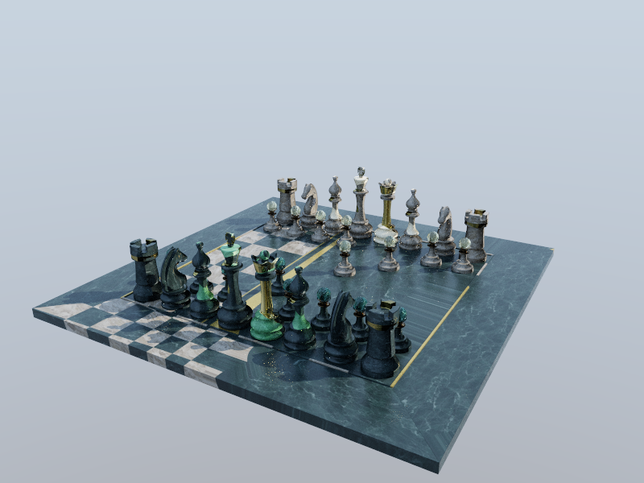
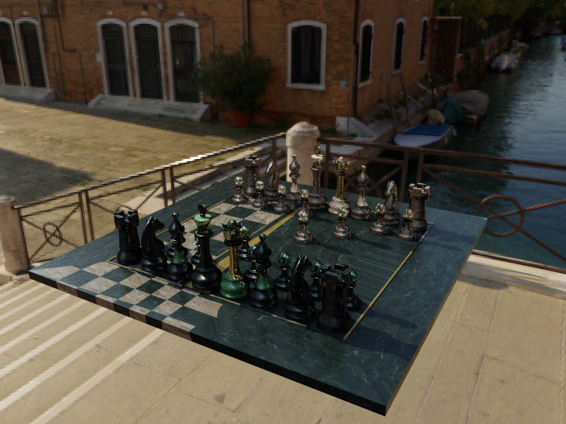
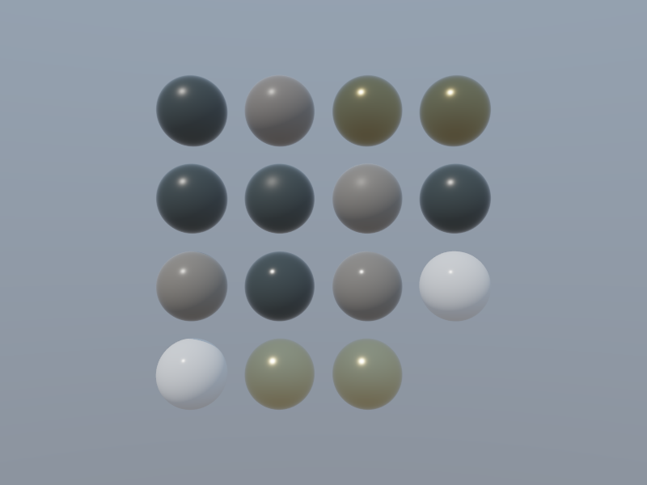
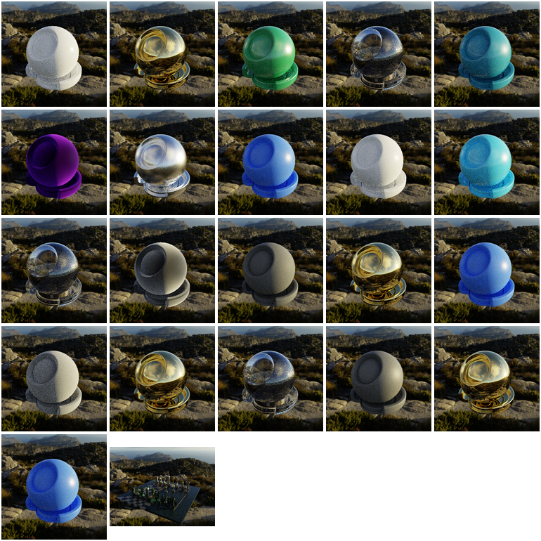

# mtlxrender

A tiny, dependency-light **C11** path tracer that renders real
[MaterialX](https://materialx.org/) assets using the LightRT triangle BVH and an
OpenPBR-style layered BSDF. Built to render the MaterialX **Chess set**.



The same scene under a Radiance `.hdr` environment (image-based lighting):



## What it does

- Loads a (binary) **glTF** mesh via **tinygltf v3** (pure-C `tg3_*` API), or a
  **Wavefront `.obj`** via a dependency-free C11 parser (`--obj`). Both feed the
  same flat `Scene`/BVH (shared `mesh_build`), so everything downstream is
  format-agnostic.
- Parses a **`.mtlx`** document with a hand-written C11 XML parser and builds an
  in-memory node graph.
- Binds materials to geometry **by name** (`<materialassign geom="...">` matches
  the glTF node/mesh name — the chess `.mtlx` has 15 such assignments).
- Evaluates the node graph with a simple demand-driven **interpreter** (one
  dispatch per node category) producing OpenPBR parameters per shade point.
  Supported node categories:
  - **textures**: `image`, `tiledimage`, `hextiledimage`, `gltf_image`,
    `gltf_colorimage`, `normalmap`, `gltf_normalmap`
  - **math**: `add` `subtract` `multiply` `divide` `modulo` `power` `min` `max`
    `atan2` `sin` `cos` `tan` `asin` `acos` `atan` `sqrt` `ln` `exp` `abs`
    `floor` `ceil` `round` `sign` `normalize` `magnitude` `dotproduct`
    `crossproduct`
  - **adjust/compositing**: `mix` `clamp` `smoothstep` `remap` `range`
    `contrast` `saturate` `luminance` `rgbtohsv` `hsvtorgb` `invert`
  - **channel**: `separate2/3/4` `combine2/3/4` `extract` `convert` `swizzle`
  - **conditional/utility**: `ifgreater` `ifgreatereq` `ifequal` `switch` `dot`
    `oneminus` `rotate2d`
  - **procedural**: `constant` `noise3d` `fractal3d` `cellnoise3d` `ramplr`
    `splitlr` `ramp4`
  - **geometric**: `texcoord` `position` `normal` `tangent` `bitangent`
    `geomcolor` `place2d`
- Supports five surface shader models, all mapped onto the OpenPBR BSDF:
  `standard_surface`, `open_pbr_surface`, `gltf_pbr`, `UsdPreviewSurface`,
  `disney_principled`.
- Path-traces with **NEE + MIS** against an environment light, Russian roulette,
  an OpenPBR-style BSDF (metallic-roughness + dielectric GGX specular + smooth
  glass transmission), and **subsurface scattering** (tinted-diffuse by default,
  or `--sss-walk` for a random walk).
- Writes a linear **EXR** (tinyexr v3) and an optional tonemapped sRGB **PNG**.
  sRGB↔linear colorspace conversion is applied to `srgb_texture`-tagged inputs.

`standard_surface` inputs map onto a single OpenPBR-style BSDF (~1:1), so the
chess set renders unchanged.

## Render backends: CPU and Vulkan GPU trace

The renderer can resolve its ray queries on the CPU or on the GPU behind a small
**ray-query backend seam** (`raytracer.h`: `rt_closest` / `rt_occluded`). A future
CUDA backend implements the same three ops with no integrator change.

- `--backend cpu` *(default)*: the recursive, tiled, multi-threaded path tracer
  (`pathtrace.c`) — full NEE+MIS, subsurface, etc.
- `--backend vk`: a **wavefront** integrator (`pathtrace_wf.c`) that issues ray
  *batches* (camera / shadow / bounce) and traces them on the GPU via
  `lrt_vk_trace_scene` (LightRT's Vulkan BVH trace). **Shading stays on the CPU
  with the full MaterialX node graph** — only the ray queries cross to the GPU.

```bash
make VK=1                       # link the Vulkan backend (runtime dlopen libvulkan)
# or: cmake -S . -B build -DMTLXRENDER_VK=ON

./mtlxrender --gltf chess_set.glb --mtlx chess.mtlx --backend vk ...   # GPU-traced
./mtlxrender --obj model.obj     --mtlx m.mtlx       --gpu-validate ... # CPU vs GPU
```

`--gpu-validate` runs the *same* wavefront on the CPU and the GPU ray backend and
reports RMSE — a simple correctness check. On an RTX 5060 Ti the cube validates
bit-identically (RMSE 0); the chess set differs only by ~1e-3 RMSE (a few
silhouette pixels where the GPU and CPU traces pick different triangles at an
edge — `lrt_vk_trace_scene` matches the CPU `t` to fp tolerance). Without a
Vulkan build or device, `--backend vk` falls back to the CPU tracer and
`--gpu-validate` reports that no device is present.

> Note: this v1 `lrt_vk_trace_scene` re-uploads the scene BVH per ray batch, so a
> multi-bounce GPU wavefront pays that each batch; it demonstrates GPU traversal
> of real meshes. A resident-scene trace path is a natural follow-up.

## MaterialX → GPU shading bridge (`mtlxvk`)

`mtlxvk` is the GPU counterpart: it evaluates every `<surfacematerial>` with the
same CPU node-graph interpreter (at one representative shade point) to **bake
constant OpenPBR parameters**, then renders **one sphere per material on the
GPU** through LightRT's Vulkan compute shading backend
(`lrt_vk_shade_analytic` / the resident `lrt_vk_shade_scene` API in
`lightrt_c_vk.h`). The node graph stays on the CPU; only the baked per-material
parameters cross to the GPU — the design the Vulkan backend is built for.



```bash
make mtlxvk          # links the mtlx evaluator + the repo-root Vulkan backend
MTLX=~/work/MaterialX/resources/Materials/Examples/StandardSurface/standard_surface_chess_set.mtlx
./mtlxvk --mtlx $MTLX --w 800 --h 600 --spp 8 --out mtlxvk_chess.ppm
```

The chess `.mtlx` bakes to 15 spheres: the gold castles/queens come back as
metal (`metalness=1`) reflecting the sky, the black/white pieces as dielectrics.
The Vulkan loader is opened at runtime (`dlopen`, no SDK); with no GPU present
`mtlxvk` prints a notice and exits 0. Because each material is collapsed to one
baked colour, spatially varying textures become a single tint per sphere, and
the GPU BSDF is the OpenPBR **core** (diffuse + metallic/dielectric GGX) — coat /
sheen / transmission / subsurface are CPU-only. See `examples/vk_shade` for the
backend itself and its GPU-vs-CPU validation.

## Build

```bash
# from this directory
./vendor_deps.sh     # fetch third-party libs into deps/ (git-ignored)
make                 # -> ./mtlxrender
# or
cmake -S . -B build && cmake --build build -j
```

`vendor_deps.sh` prefers local clones under `$HOME/work` (override with
`TINYGLTF_DIR=` / `TINYEXR_DIR=`) and falls back to cloning from GitHub.

Everything is C11. It links `lightrt_c_tri.c`, `tiny_gltf_v3.c`, and the
tinyexr v3 `src/*.c` directly (vendored under `deps/`). No external libraries.

## Render the chess set

```bash
MTLX=~/work/MaterialX/resources/Materials/Examples/StandardSurface/standard_surface_chess_set.mtlx
GLB=~/work/MaterialX/resources/Geometry/chess_set.glb

./mtlxrender --gltf $GLB --mtlx $MTLX \
    --w 800 --h 600 --spp 128 --bounces 6 \
    --sky --sun --sun-az 125 --sun-el 38 --sun-intensity 3.5 \
    --cam-yaw 30 --cam-pitch 22 --cam-dist 1.05 --exposure 1.3 \
    --out chess.exr --png chess.png
```

`--sun` adds a directional light (NEE shadow rays) for crisp cast shadows;
drop it for soft dome-only lighting. `--env` accepts both **Radiance `.hdr`**
and **`.exr`** lat-long environment maps (importance-sampled). Run
`./mtlxrender --help` for the full option list (camera orbit, thread count, etc.).

## Tests

### Per-node ground truth

`tests/node_truth.c` validates each MaterialX node against an **independently
computed ground-truth value** derived from the node's spec definition (basic
math / the documented formula), *not* from our own implementation — so it
catches real correctness bugs, not just regressions. Each case feeds inputs
through the real parse → doc → eval path (`mtlx_load_string` + a one-node graph).

```bash
make test        # builds and runs node_truth (67 assertions, all PASS)
make check       # node ground-truth + golden render regression
# or: ctest       (via CMake)
```

Covers math (`power(2,3)=8`, `dotproduct=32`, `crossproduct`, `magnitude=5`, …),
compositing/adjust (`mix`, `clamp`, `smoothstep`, `remap`, `range`, `contrast`,
`luminance`, `invert`, `saturate`), color (`rgbtohsv`/`hsvtorgb` round-trip),
channel (`combine2/3`, `extract`, `convert`, `separate3.outg`), conditional/
utility (`ifgreater`, `ifequal`, `switch`, `dot`, `oneminus`, `rotate2d`,
`ramp4`), and geometric nodes. It also validates the **surface-shader parameter
mapping** — `standard_surface` / `gltf_pbr` / `UsdPreviewSurface` /
`disney_principled` inputs onto the OpenPBR params. Procedural noise is checked
for spec invariants (determinism, output range). The suite is clean under
ASan/UBSan.

### Golden reference renders

`golden.sh` renders a curated set of example materials (across all five shader
models) on the MaterialX shaderball, plus the chess scene, under an HDRI, and
manages them as committed reference images. Renders are deterministic (fixed
seed; per-pixel RNG independent of thread scheduling), so a matching build
reproduces them bit-for-bit.

```bash
./golden.sh gen      # (re)generate references into golden/  (PNG + EXR)
./golden.sh check    # re-render and diff against golden/*.png (RMSE)
```

The committed `golden/*.png` are the visual + regression references; `check`
recomputes each and reports per-material RMSE (PASS within `TOL`, default 0.02).
`mtlxrender --diff a b [tol]` compares any two EXR/PNG images directly.



## Dependencies (vendored, under `deps/`, git-ignored)

| Library        | Source                              | Use                         |
|----------------|-------------------------------------|-----------------------------|
| tinygltf v3    | `syoyo/tinygltf` branch `v3_c`      | pure-C glTF/GLB loader      |
| tinyexr v3     | `syoyo/tinyexr` (`include/exr.h`)   | EXR read/write (pure C)     |
| tinycolorio    | tinyexr `sandbox/tocio`             | OCIO colorspace (available) |
| stb_image(_write) | `nothings/stb`                  | JPG/PNG texture & preview   |

## Notes / limitations

- The node interpreter is intentionally simple (slow but low-effort); it covers
  the node types the chess set uses, not the full MaterialX standard library.
- Colorspace handling is sRGB↔linear (what the chess assets need). The vendored
  tinycolorio is available for full OCIO config-driven transforms.
- SSS defaults to a tinted-diffuse diffusion approximation (accurate for the
  chess set's sub-millimeter mean free path); `--sss-walk` enables a bounded
  random walk.
